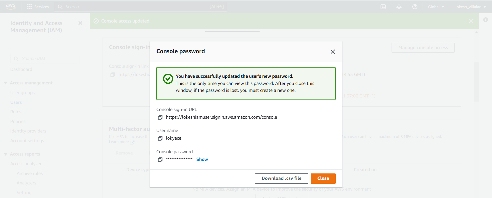
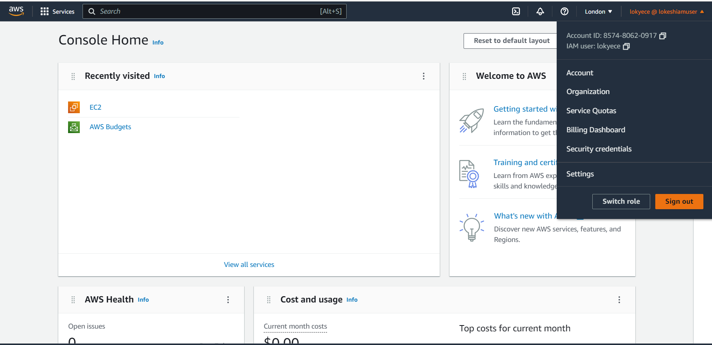
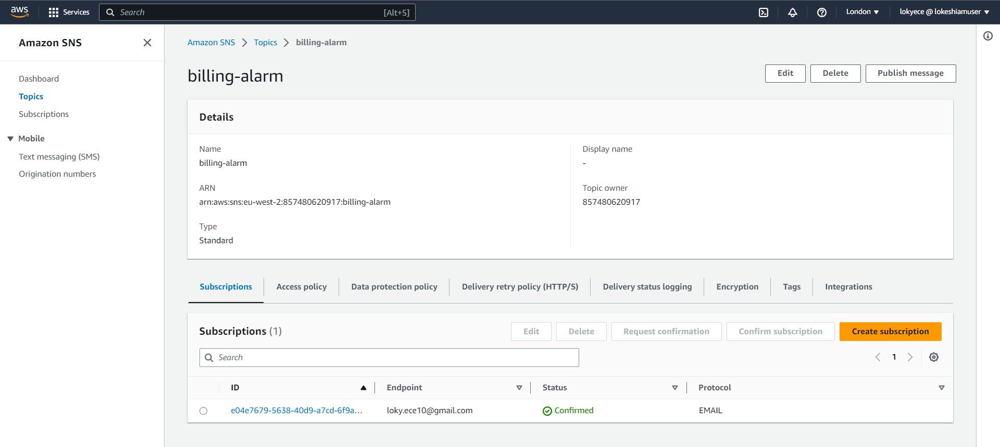
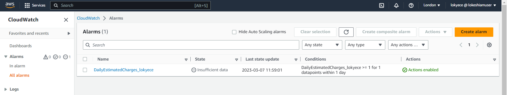
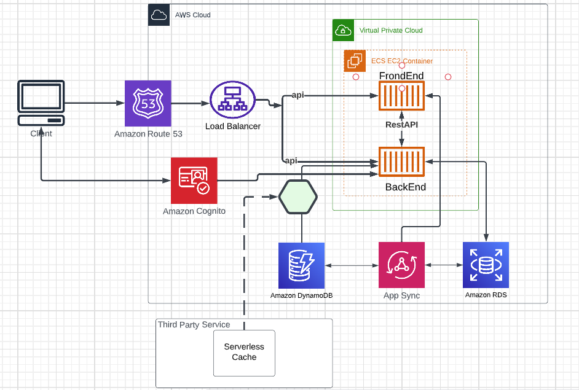
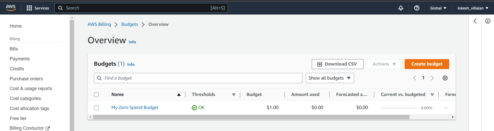
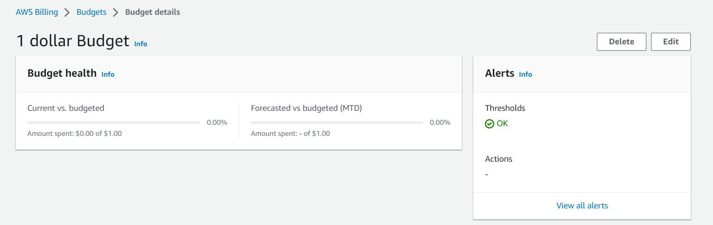
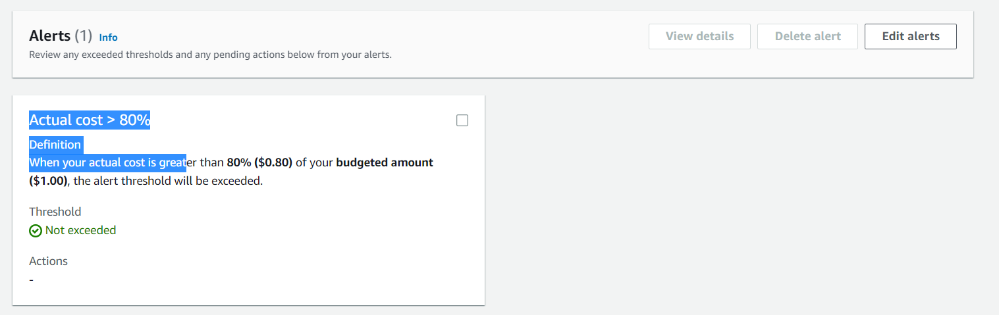

# Week 0 — Billing and Architecture

## Required Home Work

## Created a new User and Generated AWS Credentials using following Instruction
   + Go to (IAM Users Console][(https://us-east-1.console.aws.amazon.com/iamv2/home?region=us-east-1#/users)] create a new user
   + Enable console access for the user
   + Create a new Admin Group and apply AdministratorAccess
   + Create the user and go find and click into the user
   + Click on Security Credentials and Create Access Key
   + Choose AWS CLI Access
   + Download the CSV with the credentials
   
   
Updating Password



IAM User Login



User Details


### Set Env Vars

Set these credentials for the current bash terminal

```
export AWS_ACCESS_KEY_ID=""
export AWS_SECRET_ACCESS_KEY=""
export AWS_DEFAULT_REGION=us-east-1
```

Tell Gitpod to remember these credentials if we relaunch our workspaces

```
gp env AWS_ACCESS_KEY_ID=""
gp env AWS_SECRET_ACCESS_KEY=""
gp env AWS_DEFAULT_REGION=us-east-1
```

### Check that the AWS CLI is working and you are the expected user

```
aws sts get-caller-identity
```

You should see something like this:

```
{
    "UserId": "AIDA4PJOT5N2Y27IOZBLI",
    "Account": "857480620917",
    "Arn": "arn:aws:iam::857480620917:user/lokyece"
}
```


### Installed AwS CLI using following Instruction

Installed the AWS CLI when our Gitpod enviroment lanuches.
Setup AWS CLI to use partial autoprompt mode to make it easier to debug CLI commands.
The bash commands we are using are the same as the [AWS CLI Install Instructions](https://docs.aws.amazon.com/cli/latest/userguide/getting-started-install.html)

Update our .gitpod.yml to include the following task.
```
tasks:
  - name: aws-cli
    env:
      AWS_CLI_AUTO_PROMPT: on-partial
    init: |
      cd /workspace
      curl "https://awscli.amazonaws.com/awscli-exe-linux-x86_64.zip" -o "awscliv2.zip"
      unzip awscliv2.zip
      sudo ./aws/install
      cd $THEIA_WORKSPACE_ROOT	
```
Run these commands indivually to perform the install manually


## Enable Billing

We need to turn on Billing Alerts to recieve alerts...

+ In your Root Account go to the Billing Page
+ Under Billing Preferences Choose Receive Billing Alerts
+ Save Preferences

### Creating a Billing Alarm

#### Create SNS Topic

+ We need an SNS topic before we create an alarm.
+ The SNS topic is what will delivery us an alert when we get overbilled
+ aws sns create-topic

Create a SNS Topic

```
aws sns create-topic --name billing-alarm
```

which will return a TopicARN

```
arn:aws:sns:eu-west-2:857480620917:billing-alarm
```

Create a subscription supply the TopicARN and our Email

```
aws sns subscribe \
    --topic-arn="arn:aws:sns:eu-west-2:857480620917:billing-alarm" \
    --protocol=email \
    --notification-endpoint=loky.ece10@gmail.com
    
``` 

Billing Alarm



Check your email and confirm the subscription

#### Create Alarm

+ aws cloudwatch put-metric-alarm
+ Create an Alarm via AWS CLI
+ We need to update the configuration json script with the TopicARN we generated earlier
+ We are just a json file because --metrics is is required for expressions and so its easier to us a JSON file.

```
aws cloudwatch put-metric-alarm --cli-input-json file://aws/json/alarm_config.json
```


Cloudwatch Alerts



Logical Architecture Diagram [Lucid link](https://lucid.app/lucidchart/e3c975eb-a3a4-483d-8731-0fb7d053ca13/edit?viewport_loc=-284%2C85%2C2560%2C1036%2C0_0&invitationId=inv_aa2da5be-d7d9-44e3-b2da-46aa7eac3e8c)



## Create an AWS Budget

[aws budgets create-budget](https://docs.aws.amazon.com/cli/latest/reference/budgets/create-budget.html)

Get your AWS Account ID

```
aws sts get-caller-identity --query Account --output text
```

+ Supply your AWS Account ID
+ Update the json files
+ This is another case with AWS CLI its just much easier to json files due to lots of nested json

```
aws budgets create-budget \
    --account-id $AWS_ACCOUNT_ID \
    --budget file://aws/json/budget.json \
    --notifications-with-subscribers file://aws/json/budget-notifications-with-subscribers.json
```


Budget Alarm








